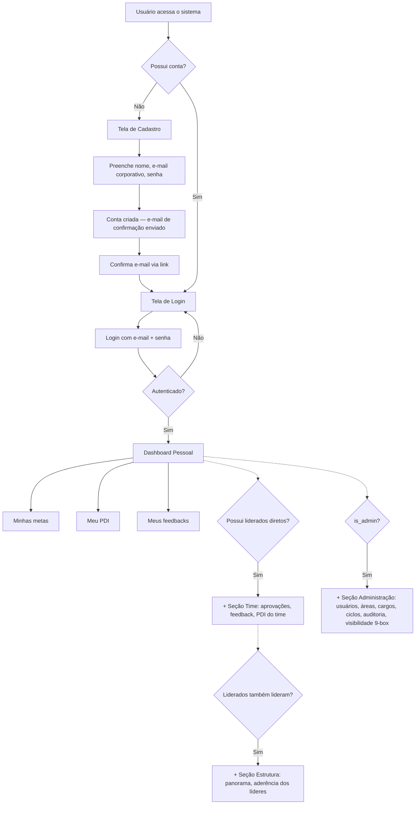
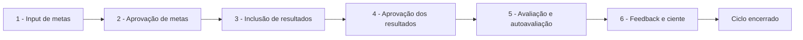

# PRD — Greenn People
### Sistema de Gestão de Performance, PDI e Avaliações

| Campo | Valor |
|---|---|
| **Produto** | Greenn People |
| **Stack** | Django 6.0.7 (full stack) · Django Templates + HTMX + Tailwind CSS · SQLite (v1) → PostgreSQL · Redis + Celery |
| **Autor deste PRD** | Gabriel (DP / Desenvolvedor interno — Greenn) |
| **Base de referência** | PRD funcional do sponsor (Iuri — COO/Pessoas), adaptado para uma implementação simples e enxuta |
| **Versão** | 1.4 (Revisada — fechamento de pendências de prontidão para desenvolvimento) |
| **Data** | Julho de 2026 |

---

## 1. Visão Geral

A Greenn não possui um sistema unificado para conduzir o ciclo de desempenho de colaboradores. Metas, avaliações, feedbacks e planos de desenvolvimento individual (PDI) ficam dispersos em planilhas, dificultando o acompanhamento histórico, a comparação entre áreas/cargos e a mensuração objetiva da aderência da liderança ao processo.

O **Greenn People** é uma aplicação web interna, construída 100% em Django (backend e frontend via Django Template Language), que centraliza:

- Cadastro de colaboradores, áreas e cargos, com hierarquia simples de liderança.
- Ciclo de avaliação de desempenho (metas → resultados → avaliação → feedback).
- Plano de Desenvolvimento Individual (PDI) com ações e prazos.
- Classificação de talentos (matriz 9-box).
- Indicador de aderência da liderança ao processo.
- Dashboards de acompanhamento por área, cargo e colaborador.
- Notificações assíncronas por e-mail (lembretes de prazo).
- Log de auditoria das principais alterações.

---

## 2. Sobre o Produto

Greenn People é um sistema **interno**, sem landing page pública. O acesso se dá por uma tela de login com opção de cadastro direto. Após autenticado, o usuário é direcionado ao seu dashboard pessoal; seções adicionais (time, estrutura, administração) aparecem conforme as visões que o usuário acumula (ver RF-03).

O sistema é organizado em **apps Django isoladas por domínio de negócio**, cada uma responsável por uma fatia clara do produto (contas, organização, competências, metas, ciclos, avaliações, PDI, talentos, dashboards, notificações e auditoria). Essa separação permite evoluir cada módulo de forma independente, mantendo o código simples e coeso.

---

## 3. Propósito

Oferecer à Greenn uma ferramenta própria, simples e auditável para:

1. Acompanhar a evolução histórica de cada colaborador.
2. Ter visão consolidada da empresa por área, cargo e liderança.
3. Rodar o ciclo de avaliação de desempenho ponta a ponta.
4. Criar e acompanhar PDIs a qualquer momento.
5. Medir objetivamente a aderência da liderança ao processo de gestão de pessoas.

---

## 4. Público-Alvo

| Papel | Descrição | Necessidade principal |
|---|---|---|
| **Colaborador** | Profissional individual, sem liderados. | Ver e atualizar suas próprias metas, feedbacks e PDI. |
| **Líder** | Lidera um time direto. | Aprovar metas/resultados, dar feedback, acompanhar PDI do time. |
| **Gerente** | Lidera líderes. | Visão consolidada da sua estrutura, aderência dos líderes. |
| **Admin (DP/RH)** | Governança do sistema. | Configurar ciclos, usuários, áreas, cargos e ver tudo. |

---

## 5. Objetivos

- **Objetivo de produto:** substituir controles manuais (planilhas) por um fluxo único, rastreável e simples de operar.
- **Objetivo técnico:** entregar um sistema Django enxuto, fácil de manter por um time pequeno (ou um único desenvolvedor), evoluindo em sprints incrementais sem necessidade de reescrita.
- **Objetivo organizacional:** dar visibilidade objetiva sobre a aderência da liderança ao ciclo de gestão de pessoas.

---

## 6. Requisitos Funcionais

### 6.1 Contas e Acesso (`accounts`)
- **RF-01** — Autenticação nativa do Django com **login por e-mail** (não por username).
- **RF-02** — Tela de cadastro (registre-se) e tela de login, com identidade visual do sistema. **Cadastro restrito por domínio de e-mail corporativo** (apenas e-mails `@greenn.com.br` são aceitos). O cadastro cria o usuário com `is_active=True`, porém **pendente de confirmação de posse do e-mail** — login bloqueado até a confirmação (RF-02.1). Não exige aprovação prévia do administrador. O primeiro usuário administrador é criado via `createsuperuser` fora do fluxo de tela.
- **RF-02.1** — Confirmação de posse do e-mail via link, usando o mesmo mecanismo de token do reset nativo de senha do Django (`PasswordResetTokenGenerator` especializado). Campo `email_confirmado_em` (datetime, nullable) em `CustomUser`, **deliberadamente separado de `is_active`** para não colidir com a semântica de offboarding (RF-04.3). Envio do e-mail de confirmação **síncrono**, via backend nativo do Django (console em dev, SMTP em produção — mesmo padrão de RF-06), sem depender do app `notifications`/Celery. Após clicar no link válido, o sistema grava `email_confirmado_em=now()` e libera o login. **Este fluxo aplica-se exclusivamente ao cadastro autônomo pela tela de registro (RF-02).** Usuários criados via `createsuperuser` ou importação de dados legados (Sprint 6.5) **não passam** por confirmação por link — nesses casos, `email_confirmado_em` é preenchido automaticamente no momento da criação/importação (Decisão #21).
- **RF-03** — O papel de um usuário **não é um estado único e exclusivo**. Todo usuário sempre tem a visão de colaborador (suas próprias metas, PDI, feedbacks); adicionalmente:
  - se o usuário é `line_manager` de alguém → ganha a visão de **líder** (aprovações, dashboard do time);
  - se o usuário é `line_manager` de outros líderes → ganha a visão de **gerente** (panorama da subárvore);
  - se `is_admin=True` → ganha acesso à área administrativa (governança).
  - Essas visões são **cumulativas e calculadas dinamicamente** (via propriedades no model/serviço), não um único campo `papel` fixo — evitando o problema de um gerente não conseguir preencher a própria meta por estar "travado" no papel de gestor.
- **RF-04** — Cada usuário pertence a uma área e tem um `line_manager` (gestor direto). O sistema suporta apenas um único gestor direto por colaborador (sem suporte para lideranças matriciais ou temporárias na v1).
- **RF-04.1** — A FK `line_manager` deve validar ausência de referência circular no `clean()`/`save()` do model (ex.: A lidera B, B lidera A; incluindo o caso trivial de tamanho 1 em que o usuário é seu próprio `line_manager`). Tentativa de salvar um ciclo na hierarquia de liderança retorna erro de validação — evita recursão infinita em `get_visible_users` (seção 9.3).
- **RF-04.2** — Campos de área, cargo e gestor (`line_manager`) são **opcionais** no `RegisterForm` (habilitados a partir da Sprint 2, quando as FKs existirem no model). Usuário sem vínculo completo (área e/ou cargo nulos) fica **fora do escopo** de qualquer líder/gerente, porém **visível ao admin**, até ser corrigido via tela de "Usuários pendentes de vínculo" ou edição manual. `line_manager` nulo **não** entra automaticamente nesse filtro de pendência, pois é um estado legítimo para o topo da hierarquia (RF-16.3).
- **RF-04.3** — Desativar um usuário (`is_active=False`) que possua **liderados diretos ativos** é **bloqueado** até o admin reatribuir manualmente cada liderado a outro `line_manager`. A desativação e cada reatribuição geram linha em `AuditLog` (RF-33).
- **RF-05** — Após login, redirecionamento para o **dashboard pessoal** por padrão; menu lateral exibe seções adicionais (Time/Estrutura/Administração) conforme as visões que o usuário possui (RF-03).
- **RF-06** — Recuperação de senha via e-mail (fluxo nativo do Django).

### 6.2 Organização (`organization`)
- **RF-07** — Cadastro de áreas/setores, com relação hierárquica simples (área pai/filha via auto-relacionamento).
- **RF-07.1** — A FK `Area.parent` deve validar ausência de referência circular no `clean()`/`save()` do model (mesma regra de RF-04.1).
- **RF-07.2** — Exclusão física de `Area` ou `Cargo` com vínculos ativos é bloqueada (`on_delete=PROTECT` nas FKs organizacionais). A proteção cobre tanto vínculo de usuário (`User.area`, `User.cargo`) quanto de subárea (`Area.parent` — impede excluir área pai enquanto houver subáreas ativas vinculadas). Desativação lógica via flag `is_active` quando necessário; registros históricos (avaliações, PDIs) nunca são apagados em cascata por exclusão acidental de área/cargo.
- **RF-08** — Cadastro de cargos, com nível/senioridade.
- **RF-09** — Vínculo colaborador → cargo → área → line manager.

### 6.3 Competências (`competencies`)
- **RF-10** — Cadastro de competências (nome, descrição, tipo: técnica/comportamental/liderança).
- **RF-11** — Cadastro de escalas de avaliação reutilizáveis (ex.: 1 a 5, com rótulo por nível). Cada `Escala` possui `valor_minimo` e `valor_maximo` explícitos, usados na normalização de notas (RF-15.1) e na validação de faixa de input.
- **RF-12** — Vínculo de competências esperadas por cargo, com a definição de peso específico para cada competência no cálculo de notas.

### 6.4 Metas e Objetivos (`goals`)
- **RF-13** — Cadastro de objetivos estratégicos da empresa.
- **RF-14** — Cadastro de metas do colaborador, vinculadas a um objetivo estratégico (cascata simples).
- **RF-14.1** — Meta possui `status` (`pendente`, `aprovada`, `reprovada`); só avança para acompanhamento de resultado após aprovação pelo líder (RF-18).
- **RF-14.2** — Meta com `status=reprovada` tem seu **próprio `status` revertido para `pendente`** (reabertura **apenas daquela meta específica**), permitindo ao colaborador ajustá-la e reenviar, sem reiniciar as metas já aprovadas. Essa reabertura afeta somente o `status` da `Meta`; **não** altera o campo `etapa` da `Avaliacao` (ver RF-17.1), que é um estado agregado e independente por colaborador/ciclo.
- **RF-14.3** — Meta possui também `status_resultado` (`pendente`, `aprovado`, `reprovado`), simétrico ao `status` de metas, controlando a aprovação do **progresso/resultado** informado pelo colaborador na etapa "aprovação de resultados" (RF-17). Só metas com `status=aprovada` entram na etapa de resultados; o `status_resultado` só pode ser preenchido/aprovado após o colaborador registrar `progresso`.
- **RF-14.4** — Meta com `status_resultado=reprovado` tem seu **próprio `status_resultado` revertido para `pendente`** (reabertura pontual daquela meta), permitindo ao colaborador ajustar o progresso e reenviar — mesma mecânica de RF-14.2, sem alterar o campo `etapa` da `Avaliacao` (ver RF-17.2).
- **RF-15** — Acompanhamento de progresso (% de atingimento) por meta. Metas alimentam o eixo de **desempenho** do colaborador de forma consultiva e de acompanhamento; não entram no cálculo da média ponderada de competências. A edição de `progresso` só é permitida enquanto a `Avaliacao` do colaborador estiver na etapa `resultados` (RF-15.2).
- **RF-15.1** — A `nota_final_lider` da avaliação de um ciclo é calculada como a **média ponderada das notas normalizadas de competência dadas pelo líder (`AvaliacaoCompetencia.nota_lider`)**, utilizando o peso congelado no momento da avaliação (`AvaliacaoCompetencia.peso_utilizado`) — nunca o peso atual de `CargoCompetencia.peso`. Antes de ponderar, cada nota é normalizada pela escala da competência: `nota_normalizada = (nota_lider - valor_minimo) / (valor_maximo - valor_minimo)`, onde `valor_minimo`/`valor_maximo` vêm da `Escala` vinculada à competência (RF-11). A fórmula final é: `nota_final_lider = Σ(nota_normalizada × peso_utilizado) / Σ(peso_utilizado)`. Garante reprodutibilidade retroativa mesmo após reajustes de peso ou escala pelo RH, e permite competências com escalas distintas no mesmo cargo.
- **RF-15.2** — O campo `Meta.progresso` é **somente leitura** fora da etapa `resultados` da `Avaliacao` correspondente — impede alteração retroativa de resultados após o ciclo já ter avançado para "avaliação" ou "feedback".

### 6.5 Ciclo de Avaliação (`cycles` + `reviews`)
- **RF-16** — Cadastro de ciclos de avaliação (período de início/fim); o `Ciclo` define apenas a janela de tempo, **não** um estado global — cada colaborador progride pelas etapas no seu próprio ritmo.
- **RF-16.1** — Encerramento de ciclo: o ciclo é **sempre encerrado de forma manual pelo administrador**. O fluxo de abertura e fechamento é controlado pelo admin, ignorando automações baseadas em `data_fim`. A partir do encerramento manual, nenhuma etapa pode mais avançar. Avaliações que não chegaram à etapa "feedback" ficam marcadas como **não concluídas**, alimentando o KPI de % de ciclo concluído.
- **RF-16.2** — Na **abertura manual** de um ciclo pelo administrador, o sistema cria automaticamente um registro `Avaliacao` (etapa inicial `input de metas`) para **todos os usuários ativos** (`is_active=True`), garantindo denominador correto no KPI de % de ciclo concluído. Apenas **um ciclo** pode estar aberto por vez na v1.
- **RF-16.3** — Colaborador sem `line_manager` (topo da hierarquia): aprovações de meta e de resultado são realizadas por um usuário com `is_admin=True`, via mesma tela de aprovação usada pelos líderes.
- **RF-17** — Fluxo de etapas por colaborador (campo `etapa` no model `Avaliacao`, um registro por usuário por ciclo): `input de metas` → `aprovação de metas` → `resultados` → `aprovação de resultados` → `avaliação` → `feedback`.
- **RF-17.1** — O campo `etapa` da `Avaliacao` é um **estado agregado por colaborador/ciclo**, não um espelho do `status` de cada `Meta` individual (RF-14.1/RF-14.2). O avanço de `aprovação de metas` para `resultados` só ocorre quando o colaborador possui **ao menos 1 meta** no ciclo **e 100% delas** estiverem com `status=aprovada`. Zero metas **não** satisfaz a pré-condição — a etapa permanece em `aprovação de metas`. Havendo qualquer meta `pendente` ou `reprovada`, a `etapa` **permanece** em `aprovação de metas` — nunca retrocede automaticamente para `input de metas` por causa de uma reprovação pontual, e nunca avança parcialmente. Essa mesma checagem agregada é o que bloqueia o acesso à tela de inclusão de resultados enquanto houver qualquer meta não aprovada (RF-18).
- **RF-17.2** — O avanço de `aprovação de resultados` para `avaliação` segue a mesma lógica agregada de RF-17.1, porém sobre `status_resultado` (RF-14.3/RF-14.4): exige **ao menos 1 meta** com `status=aprovada` **e 100% delas** com `status_resultado=aprovado`. Reprovação pontual de resultado reabre apenas aquela meta (RF-14.4), sem retroceder a `etapa` global.
- **RF-18** — Bloqueio de avanço de etapa sem aprovação da etapa anterior.
- **RF-19** — Autoavaliação do colaborador, exibida lado a lado com a avaliação do líder. Cada competência recebe duas notas independentes (`nota_autoavaliacao` e `nota_lider`), preservando ambas — a nota do líder não sobrescreve a do colaborador.
- **RF-19.1** — `nota_final_lider` (campo em `Avaliacao`) é a nota que efetivamente conta para o ciclo; `nota_final_autoavaliacao` é apenas referência de comparação, opcional.
- **RF-19.2** — Ao criar as linhas de `AvaliacaoCompetencia` (início da etapa "avaliação"), o sistema copia o `peso` e o `nivel_esperado` vigentes de `CargoCompetencia` para os campos snapshot `peso_utilizado` e `nivel_esperado_utilizado` (write-once, via serviço interno). Esses campos **não são editáveis** via formulário e nunca são reescritos, mesmo que o RH altere o perfil de competências do cargo posteriormente — preservando a auditabilidade histórica do cálculo e da comparação com o nível esperado (US-14).
- **RF-19.3** — O avanço para a etapa "avaliação" é **bloqueado** se o cargo do colaborador não possuir ao menos uma `CargoCompetencia` vinculada **ou se a soma dos `peso` das competências do cargo for zero** — evita divisão por zero em `calcular_nota_final_lider` (RF-15.1). O serviço `calcular_nota_final_lider` deve incluir guarda defensiva própria (exceção tratada) mesmo que o bloqueio de etapa já devesse impedir chegar a esse estado. O admin deve configurar o perfil de competências do cargo (com pesos > 0) antes de abrir o ciclo ou antes que colaboradores desse cargo avancem para avaliação.
- **RF-20** — Registro de feedback (anotação do colaborador e anotação do líder), com histórico por ciclo; ao receber o feedback, o colaborador registra "ciente" (`ciente_em`, data/hora), ficando visível que a leitura ocorreu.

### 6.6 PDI (`pdi`)
- **RF-21** — Criação de PDI a qualquer momento (não depende do ciclo estar aberto).
- **RF-22** — Ações de PDI com responsável, prazo e status (`pendente`, `em andamento`, `concluída`, `atrasada`).
- **RF-23** — Acompanhamento de progresso do PDI (percentual de ações concluídas).

### 6.7 Talentos (`talent`)
- **RF-24** — Classificação do colaborador na matriz 9-box (desempenho × potencial), **vinculada a um ciclo específico** (`ciclo_id`), preservando o histórico de classificação entre ciclos. Ambos os eixos usam escala fixa **1 a 3** (baixo / médio / alto). O eixo `desempenho` é derivado automaticamente da `nota_final_lider` normalizada (0–1) do ciclo: `< 0,33 → 1 (baixo)`, `0,33–0,66 → 2 (médio)`, `> 0,66 → 3 (alto)`. O eixo `potencial` é **inserido de forma 100% manual pelo administrador** (valor inteiro 1, 2 ou 3). O campo `quadrante` é calculado pelo serviço a partir do par `(desempenho, potencial)` conforme tabela abaixo — nunca editável manualmente:

  | desempenho ↓ / potencial → | 1 (baixo) | 2 (médio) | 3 (alto) |
  |---|---|---|---|
  | **1 (baixo)** | `baixo_baixo` | `baixo_medio` | `baixo_alto` |
  | **2 (médio)** | `medio_baixo` | `medio_medio` | `medio_alto` |
  | **3 (alto)** | `alto_baixo` | `alto_medio` | `alto_alto` |
- **RF-25** — Por padrão o colaborador **não vê** sua própria classificação; visibilidade liberada apenas pelo admin, registro a registro.

### 6.8 Aderência de Liderança e Dashboards (`dashboard`)
- **RF-26** — Cálculo do índice de aderência do líder (cumprimento de etapas/ações no prazo: aprovações, feedbacks, PDIs), processado via Celery e **persistido** em `AderenciaSnapshot` (líder, ciclo, percentual, componentes do cálculo em JSON, data do cálculo) — os dashboards leem o snapshot já calculado, sem recalcular a cada acesso. O cálculo atribui cada ação ao **autor real** registrado no momento da execução (usuário que aprovou/deu feedback, conforme `AuditLog` ou campo `autor_id` da ação) — **nunca** reconsulta o `line_manager` atual do colaborador, evitando atribuição incorreta após reorganizações hierárquicas.
- **RF-27** — Dashboard do colaborador: minhas metas, meu PDI, meus feedbacks.
- **RF-28** — Dashboard do líder: pendências do time, aderência própria.
- **RF-29** — Dashboard do gerente: panorama da sua estrutura (líderes e áreas abaixo dele).
- **RF-30** — Dashboard do admin: panorama geral por área e cargo.

### 6.9 Notificações (`notifications`)
- **RF-31** — Envio assíncrono (Celery) de e-mails de lembrete: prazo de etapa próximo, ação de PDI vencendo. Cada envio é registrado em `NotificacaoLog` (destinatário, tipo, status `enviado`/`falha`, erro, data), permitindo ao admin consultar falhas de entrega.
- **RF-32** — Agendamento recorrente de verificação de prazos via Celery Beat.
- **RF-32.1** — A mesma tarefa diária do Celery Beat marca como `atrasada` as ações de PDI e etapas de ciclo cujo prazo já venceu sem conclusão (gatilho do status `atrasada` referenciado em RF-22).

### 6.10 Auditoria (`audit`)
- **RF-33** — Registro de alterações em dados sensíveis: resultado/nota de avaliação, classificação 9-box, mudança de `is_admin`/`is_active`/área/cargo/line manager de um usuário, aprovação/reabertura de etapa do ciclo — sempre com **entidade e ID do registro alterado** (`entity_type`/`entity_id`), **campo alterado** (`campo`), valor anterior, valor novo, autor (`usuario_id`, nullable para ações de sistema/Celery) e data. Cada alteração de campo gera **uma linha** de `AuditLog` (granularidade por campo, não snapshot completo do objeto).
- **RF-34** — Tela de consulta de auditoria, restrita ao admin, com filtro por usuário, ação e período.
- **RF-35** — Log de auditoria é **append-only**: nenhum usuário, incluindo admin, pode editar ou excluir um registro já gravado (nem pelo admin nativo do Django).
- **RF-36** — Tentativas de acesso negado por escopo são registradas **somente quando o registro existe no banco mas está fora do escopo do usuário** (bloqueio do `ScopedObjectMixin`). URLs/IDs inexistentes retornam 404 genérico **sem** gerar registro de auditoria — evita poluir o log com erros de digitação ou links quebrados.

---

## 7. Flowchart Mermaid — Fluxos de UX





---

## 8. Requisitos Não-Funcionais

| Categoria | Requisito |
|---|---|
| Simplicidade | Sem camadas desnecessárias; usar recursos nativos do Django sempre que possível. |
| Usabilidade | Interface responsiva (desktop e mobile), tarefas-chave em poucos cliques. |
| Desempenho | Páginas comuns < 2s; tarefas pesadas (cálculo de aderência, e-mails) processadas via Celery, fora do ciclo de request. |
| Idioma | Código-fonte em inglês; toda a interface do usuário em português brasileiro. |
| Padrão de código | PEP 8, aspas simples, Class-Based Views sempre que possível. |
| Banco de dados | SQLite em desenvolvimento; estrutura pronta para migração para PostgreSQL sem alterações de modelo. |
| Assíncrono | Redis como broker/result backend do Celery; Celery Beat para tarefas agendadas. |
| Manutenibilidade | Signals concentrados em signals.py por app; models com created_at/updated_at padronizados via mixin. |
| Segurança — listas | Toda ListView/consulta agregada filtra o queryset pelo escopo do usuário (ver 9.3), nunca confiando apenas em esconder botões/links na interface. |
| Segurança — objeto individual | Toda DetailView/UpdateView/DeleteView valida, no get_object(), se o registro acessado pertence ao escopo do usuário logado — mesmo que o ID venha direto na URL (proteção contra acesso indevido por manipulação de URL, tipo IDOR). Acesso fora do escopo retorna 404/403, nunca vaza dado. |
| Segurança — infraestrutura | CSRF, proteção de sessão e cabeçalhos de segurança padrão do Django habilitados; senhas com hash nativo (PBKDF2). Validadores padrão do Django (`AUTH_PASSWORD_VALIDATORS`): `UserAttributeSimilarityValidator`, `MinimumLengthValidator` com `min_length=8`, `CommonPasswordValidator`, `NumericPasswordValidator` (Decisão #23). |
| Paginação | `paginate_by = 20` itens por página como padrão em todas as `ListView` (Decisão #23). |
| Sessão | `SESSION_COOKIE_AGE` padrão do Django (2 semanas / 1.209.600 segundos); sessão persiste ao fechar o navegador (sem `SESSION_EXPIRE_AT_BROWSER_CLOSE`) (Decisão #23). |
| Auditabilidade | Log de auditoria é append-only (sem edição/exclusão, inclusive no admin do Django); cada alteração de dado sensível gera uma linha por campo (`campo`, valor anterior, valor novo, autor nullable, timestamp). |
| Histórico | Cada ciclo gera registros próprios de avaliação vinculados ao colaborador, preservando a evolução completa entre ciclos (nunca sobrescrevendo dado de ciclo anterior); PDI mantém histórico de mudança de status de cada ação. |
| Performance/Escala | Índices em campos usados para escopo e filtro (line_manager, area, ciclo, usuario); uso de select_related/prefetch_related nas queries de listagem e dashboard; paginação obrigatória em toda listagem; cálculos pesados (aderência, agregações de dashboard) processados via Celery e não no request síncrono. |
| Entregas futuras | Docker e testes automatizados previstos apenas nas sprints finais (ver seção 14); testes de segurança de escopo (item 14.2.2) cobrem especificamente tentativa de acesso cruzado entre usuários/gestores. |

---

## 9. Arquitetura Técnica

### 9.1 Stack

| Camada | Tecnologia | Observação |
|---|---|---|
| Backend/Framework | Django 5.x | Full stack, sem DRF na v1. |
| Frontend | Django Template Language (DTL) + HTMX + Tailwind CSS | Interatividade sem SPA; toda lógica de permissão no servidor. |
| Build do Tailwind | Tailwind CLI standalone (binário, sem depender de Node.js) | Mantém o setup simples, um único comando de watch/build. |
| Banco de dados | SQLite (v1) → PostgreSQL (planejado) | Sem uso de recursos exclusivos de um banco, para migração tranquila. |
| Fila/Assíncrono | Celery + Redis | E-mails de lembrete e cálculo de aderência em background. |
| Agendamento | Celery Beat | Verificação periódica de prazos (diária). |
| Autenticação | Sistema nativo do Django, com AbstractUser customizado (USERNAME_FIELD = 'email') | Sem django-allauth/MFA. |
| Hierarquia organizacional | Auto-relacionamento simples (self FK) em vez de biblioteca de árvore | Suficiente para a profundidade esperada (colaborador → líder → gerente). |
| Auditoria | Model próprio AuditLog (app audit), populado via signals | Sem biblioteca externa de versionamento. |
| E-mail | Backend de e-mail nativo do Django (console em dev, SMTP em produção) | Sem provedor transacional externo na v1. |
| Containerização | Docker/Docker Compose | Planejado apenas para as sprints finais. |
| Testes | Django TestCase / pytest-django | Planejado apenas para as sprints finais. |

### 9.2 Apps Django (separação por domínio)

| App | Responsabilidade |
|---|---|
| core | Recursos compartilhados: modelo base com created_at/updated_at, mixins, templates base, componentes de UI reutilizáveis. |
| accounts | Usuário customizado, login por e-mail, cadastro, visões cumulativas (colaborador/líder/gerente/admin). |
| organization | Áreas, cargos, hierarquia colaborador → line manager. |
| competencies | Competências, escalas, perfil esperado por cargo. |
| goals | Objetivos estratégicos e metas do colaborador. |
| cycles | Ciclos de avaliação e máquina de estados das etapas. |
| reviews | Avaliações, autoavaliação, feedbacks. |
| pdi | Planos de desenvolvimento individual e ações. |
| talent | Classificação 9-box e controle de visibilidade. |
| dashboard | Views agregadas por visão do usuário (colaborador/líder/gerente/admin), cálculo de aderência de liderança. |
| notifications | Tarefas Celery de e-mail e agendamentos (Celery Beat). |
| audit | Registro e consulta de logs de auditoria. |

### 9.3 Resolução de Escopo (visibilidade de dados)

Um serviço simples por app (ex.: função `get_visible_users(request.user)`) resolve o queryset permitido conforme a posição do usuário na hierarquia (`line_manager`), e não um campo fixo de papel:

- **Colaborador** → apenas o próprio registro.
- **Líder** → próprio + membros diretos do seu time (via `line_manager`).
- **Gerente** → próprio + toda a cadeia de liderados dos seus líderes.
- **Admin** → sem filtro.

Essa resolução acontece sempre na view (nunca só no template), evitando vazamento de dados.

**Regra de ouro:** o mesmo filtro de escopo é aplicado em dois pontos, não só um:

1. **Listagens** (`ListView.get_queryset()`): o usuário só vê, na lista, o que está no seu escopo.
2. **Objeto individual** (`get_object()` de `DetailView`/`UpdateView`/`DeleteView`): antes de exibir ou permitir editar um registro específico, a view confirma que aquele registro pertence ao escopo do usuário logado — mesmo que o ID venha direto na URL. Um gestor não conseguir abrir a URL do PDI ou da avaliação de outro gestor/colaborador fora da sua estrutura, mesmo digitando o link manualmente, é um critério de aceite obrigatório (ver seção 12, US-09).

Na prática, isso é implementado como um mixin único (`ScopedObjectMixin`), reaproveitado por todas as views sensíveis do sistema (avaliações, PDI, feedbacks, classificação 9-box), para não depender de cada desenvolvedor lembrar de repetir a checagem manualmente.

**Validação de hierarquia:** `Area.parent` e `User.line_manager` validam ausência de ciclo no `clean()`/`save()` (RF-04.1, RF-07.1). A resolução de escopo de gerente (subárvore completa) deve usar query otimizada (CTE recursiva ou materialização em cache) — traversal recursivo puro em Python gera N+1 e risco de stack overflow em estruturas profundas.

**Política de `on_delete` em FKs organizacionais (RF-07.2):**

| FK | Comportamento | Motivo |
|---|---|---|
| `User.line_manager` | `SET_NULL` | Colaborador permanece ativo se gestor for desativado |
| `User.area`, `User.cargo` | `PROTECT` | Impede exclusão de área/cargo com usuários vinculados |
| `Area.parent` | `PROTECT` | Impede exclusão física de área com subáreas ativas vinculadas — remoção lógica via `is_active` quando necessário |
| `CargoCompetencia.cargo/competencia` | `PROTECT` | Impede apagar cargo/competência com perfil ou histórico |
| `Avaliacao`, `Meta`, `PDI`, `Feedback` | `PROTECT` em FKs de usuário/ciclo | Preserva histórico — nunca CASCADE em dados de ciclo |

### 9.4 Estrutura de Dados — Schema Mermaid

```mermaid
erDiagram
    USER ||--o{ USER : "line_manager"
    AREA ||--o{ AREA : "parent"
    AREA ||--o{ USER : "possui"
    CARGO ||--o{ USER : "ocupa"
    CARGO ||--o{ CARGO_COMPETENCIA : "espera"
    COMPETENCIA ||--o{ CARGO_COMPETENCIA : "referenciada"
    COMPETENCIA }o--|| ESCALA : "usa"
    USER ||--o{ META : "possui"
    OBJETIVO_ESTRATEGICO ||--o{ META : "desdobra"
    CICLO ||--o{ AVALIACAO : "contém"
    USER ||--o{ AVALIACAO : "avaliado"
    AVALIACAO ||--o{ AVALIACAO_COMPETENCIA : "detalha"
    AVALIACAO ||--o{ FEEDBACK : "gera"
    USER ||--o{ PDI : "possui"
    PDI ||--o{ ACAO_PDI : "contém"
    USER ||--o{ CLASSIFICACAO_TALENTO : "classificado"
    CICLO ||--o{ CLASSIFICACAO_TALENTO : "referencia"
    USER ||--o{ ADERENCIA_SNAPSHOT : "lidera"
    CICLO ||--o{ ADERENCIA_SNAPSHOT : "referencia"
    USER ||--o{ NOTIFICACAO_LOG : "recebe"
    USER ||--o{ AUDIT_LOG : "gera"

    USER {
        int id PK
        string email UK
        string nome
        boolean is_admin
        int cargo_id FK "on_delete=PROTECT"
        int area_id FK "on_delete=PROTECT"
        int line_manager_id FK "on_delete=SET_NULL nullable"
        date data_entrada
        boolean is_active
        datetime email_confirmado_em "nullable confirma posse do e-mail RF-02.1"
        datetime created_at
        datetime updated_at
    }

    AREA {
        int id PK
        string nome
        int parent_id FK "on_delete=PROTECT nullable"
        boolean is_active
        datetime created_at
        datetime updated_at
    }

    CARGO {
        int id PK
        string nome
        int nivel
        boolean is_active
        datetime created_at
        datetime updated_at
    }

    ESCALA {
        int id PK
        string nome
        int valor_minimo
        int valor_maximo
        json rotulos_por_nivel
        datetime created_at
        datetime updated_at
    }

    COMPETENCIA {
        int id PK
        string nome
        string tipo
        int escala_id FK
        datetime created_at
        datetime updated_at
    }

    CARGO_COMPETENCIA {
        int id PK
        int cargo_id FK
        int competencia_id FK
        decimal nivel_esperado
        decimal peso
        datetime created_at
        datetime updated_at
    }

    OBJETIVO_ESTRATEGICO {
        int id PK
        string descricao
        int ciclo_id FK
        datetime created_at
        datetime updated_at
    }

    META {
        int id PK
        int usuario_id FK "on_delete=PROTECT"
        int objetivo_estrategico_id FK "on_delete=PROTECT"
        string descricao
        decimal progresso
        string status "aprovacao de meta pendente aprovada reprovada"
        string status_resultado "aprovacao de resultado pendente aprovado reprovado"
        datetime created_at
        datetime updated_at
    }

    CICLO {
        int id PK
        string nome
        date data_inicio
        date data_fim
        string status "aberto encerrado"
        datetime created_at
        datetime updated_at
    }

    AVALIACAO {
        int id PK
        int ciclo_id FK
        int usuario_id FK
        decimal nota_final_lider
        decimal nota_final_autoavaliacao
        string etapa
        datetime created_at
        datetime updated_at
    }

    AVALIACAO_COMPETENCIA {
        int id PK
        int avaliacao_id FK
        int competencia_id FK
        decimal nota_autoavaliacao
        decimal nota_lider
        decimal peso_utilizado "snapshot imutavel do peso no momento da avaliacao"
        decimal nivel_esperado_utilizado "snapshot imutavel do nivel esperado no momento da avaliacao"
        datetime created_at
        datetime updated_at
    }

    FEEDBACK {
        int id PK
        int avaliacao_id FK
        int autor_id FK
        string tipo
        text conteudo
        datetime ciente_em
        datetime created_at
        datetime updated_at
    }

    PDI {
        int id PK
        int usuario_id FK
        string titulo
        string status
        datetime created_at
        datetime updated_at
    }

    ACAO_PDI {
        int id PK
        int pdi_id FK
        string descricao
        int responsavel_id FK
        date prazo
        string status
        datetime created_at
        datetime updated_at
    }

    CLASSIFICACAO_TALENTO {
        int id PK
        int usuario_id FK "on_delete=PROTECT"
        int ciclo_id FK "on_delete=PROTECT"
        int desempenho "1 a 3 baixo medio alto derivado de nota_final_lider"
        int potencial "1 a 3 inserido manualmente pelo admin"
        string quadrante "calculado desempenho x potencial RF-24"
        boolean visivel_ao_colaborador
        datetime created_at
        datetime updated_at
    }

    ADERENCIA_SNAPSHOT {
        int id PK
        int lider_id FK
        int ciclo_id FK
        decimal percentual
        json componentes
        datetime calculado_em
        datetime created_at
        datetime updated_at
    }

    NOTIFICACAO_LOG {
        int id PK
        int destinatario_id FK
        string tipo
        string status
        text erro
        datetime created_at
    }

    AUDIT_LOG {
        int id PK
        int usuario_id FK "autor nullable acao de sistema Celery"
        string acao
        string entity_type "entidade alterada"
        int entity_id "registro alterado"
        string campo "campo alterado granularidade por campo RF-33"
        text valor_anterior
        text valor_novo
        datetime created_at
    }
```



---

## 10. Design System

Identidade visual moderna, clara e responsiva, aplicada de forma consistente em todas as telas via Tailwind CSS dentro do Django Template Language (template base + componentes reutilizáveis via ``).

### 10.1 Paleta de Cores

| Uso | Tailwind | Hex aproximado |
|---|---|---|
| Primária (gradiente) | from-emerald-600 to-teal-500 | #059669 → #14b8a6 |
| Primária hover | from-emerald-700 to-teal-600 | #047857 → #0d9488 |
| Fundo principal | bg-slate-50 | #f8fafc |
| Fundo de cartões | bg-white | #ffffff |
| Texto principal | text-slate-800 | #1e293b |
| Texto secundário | text-slate-500 | #64748b |
| Bordas | border-slate-200 | #e2e8f0 |
| Sucesso / aderência alta | text-emerald-600 / bg-emerald-50 | — |
| Alerta / aderência média | text-amber-600 / bg-amber-50 | — |
| Crítico / aderência baixa | text-rose-600 / bg-rose-50 | — |

### 10.2 Tipografia

- Fonte: Inter (Google Fonts, carregada localmente para evitar dependência externa em runtime).
- Hierarquia: `text-2xl font-semibold` (títulos de página), `text-lg font-medium` (títulos de cartão), `text-sm` (corpo), `text-xs text-slate-500` (auxiliar).

### 10.3 Botões

```html
<!-- Botão primário -->
<button class="bg-gradient-to-r from-emerald-600 to-teal-500 hover:from-emerald-700 hover:to-teal-600
               text-white font-medium rounded-lg px-4 py-2 shadow-sm transition-colors">
  Salvar
</button>

<!-- Botão secundário -->
<button class="bg-white border border-slate-200 text-slate-700 hover:bg-slate-50
               font-medium rounded-lg px-4 py-2 transition-colors">
  Cancelar
</button>
```

### 10.4 Inputs e Forms

```html
<div class="mb-4">
  <label class="block text-sm font-medium text-slate-700 mb-1">E-mail</label>
  <input type="email" name="email"
         class="w-full rounded-lg border border-slate-200 px-3 py-2 text-sm
                focus:outline-none focus:ring-2 focus:ring-emerald-500 focus:border-transparent" />
</div>
```

### 10.5 Cartões e Grid

```html
<div class="grid grid-cols-1 md:grid-cols-3 gap-4">
  <div class="bg-white rounded-xl border border-slate-200 shadow-sm p-5">
    <p class="text-xs text-slate-500 uppercase tracking-wide">Aderência</p>
    <p class="text-2xl font-semibold text-slate-800">86%</p>
  </div>
</div>
```

### 10.6 Menu Lateral (layout base)

- Sidebar fixa à esquerda (`bg-white border-r border-slate-200`), com logo no topo e itens de navegação exibidos conforme as visões cumulativas do usuário (colaborador sempre, + time/estrutura/administração via `` no template base).
- Item ativo: fundo `bg-emerald-50 text-emerald-700 font-medium`.
- Topbar com nome do usuário e botão de logout.

### 10.7 Componentes reutilizáveis (templates parciais)

- `components/button.html`, `components/input.html`, `components/card.html`, `components/badge_status.html` (usado para status de ações do PDI e aderência), `components/sidebar.html`, `components/topbar.html`.
- HTMX usado para: submissão de formulários sem reload, atualização parcial de listas (ex.: lista de ações do PDI), modais de criação/edição.

### 10.8 Páginas de erro (404 / 403)

Templates customizados (`404.html`, `403.html`) seguindo a identidade visual do produto (mesma sidebar/topbar quando o usuário está autenticado, cartão central com ícone, mensagem em português e botão de voltar ao dashboard). Usadas tanto para páginas inexistentes quanto para os bloqueios de acesso do `ScopedObjectMixin` (US-09), sem qualquer indício visual de que o registro existe ou não — a mensagem é genérica ("Você não tem acesso a este recurso ou ele não existe").

---

## 11. User Stories

### Épico 1 — Autenticação e Acesso

**US-01:** Como colaborador com e-mail corporativo @greenn.com.br, quero me cadastrar com e-mail e senha e confirmar a posse do meu e-mail, para acessar o sistema após a confirmação, sem precisar de aprovação manual do administrador.
Critério de aceite: dado que preencho nome, e-mail com domínio @greenn.com.br e senha, quando envio o formulário, então minha conta é criada, recebo um e-mail com link de confirmação e sou redirecionado para a tela "verifique seu e-mail"; enquanto `email_confirmado_em` for nulo, o login é bloqueado; após clicar no link válido, posso fazer login normalmente; e-mails fora do domínio @greenn.com.br são rejeitados no formulário de cadastro.

**US-02:** Como usuário, quero logar com e-mail e senha, para acessar meu dashboard.
Critério de aceite: dado que informo credenciais válidas, quando faço login, então sou redirecionado ao meu dashboard pessoal, com as seções adicionais (time/estrutura/administração) visíveis conforme minhas visões cumulativas (RF-03).

### Épico 8 — Organização

**US-11:** Como admin, quero cadastrar áreas e cargos e vincular cada colaborador a uma área, cargo e gestor direto, para que a estrutura organizacional reflita a realidade da empresa.
Critério de aceite: dado que cadastro uma área/cargo e vinculo um usuário, quando salvo, então o usuário passa a aparecer no escopo do seu line_manager (listagens e dashboards).

**US-12:** Como admin, quero organizar áreas em uma hierarquia (área pai/filha), para representar setores e subsetores.
Critério de aceite: dado que crio uma área com parent definido, quando visualizo a listagem de áreas, então a hierarquia aparece indentada/agrupada.

### Épico 9 — Competências

**US-13:** Como admin, quero cadastrar competências, escalas de avaliação reutilizáveis e pesos específicos, para usá-los no cálculo ponderado dos ciclos de avaliação.
Critério de aceite: dado que crio uma competência vinculada a uma escala, quando a associo a um cargo e lhe atribuo um peso, então ela passa a aparecer na tela de avaliação de qualquer colaborador daquele cargo e influencia diretamente a média final.

**US-14:** Como admin, quero definir o nível esperado de cada competência por cargo, para que a avaliação tenha um parâmetro de comparação.
Critério de aceite: dado que defino um nivel_esperado para uma competência de um cargo, quando um colaborador daquele cargo é avaliado, então a nota do líder é comparada ao nível esperado na tela de avaliação.

### Épico 2 — Ciclo de Avaliação

**US-03:** Como colaborador, quero cadastrar minhas metas no ciclo, para que sejam aprovadas pelo meu líder.
Critério de aceite: dado um ciclo na etapa "input de metas", quando cadastro uma meta, então ela fica com status "pendente de aprovação".

**US-04:** Como líder, quero aprovar as metas do meu time, para liberar a etapa seguinte do ciclo.
Critério de aceite: dado que todas as metas do colaborador foram aprovadas, quando o líder confirma, então o ciclo do colaborador avança para "inclusão de resultados".

### Épico 3 — PDI

**US-05:** Como colaborador, quero criar um PDI a qualquer momento, para organizar minhas ações de desenvolvimento.
Critério de aceite: dado que estou autenticado, quando crio um PDI com ao menos uma ação, então o PDI aparece no meu dashboard com progresso 0%.

### Épico 4 — Talentos

**US-06:** Como admin, quero classificar um colaborador na matriz 9-box de forma manual, definindo seu potencial diretamente, para apoiar decisões de desenvolvimento.
Critério de aceite: dado que insiro o potencial do colaborador manualmente e confirmo, quando não libero a visibilidade, então o colaborador não vê essa informação em seu dashboard.

### Épico 5 — Dashboards e Aderência

**US-07:** Como gerente, quero ver a aderência dos meus líderes, para identificar pontos de atenção.
Critério de aceite: dado que existem ações e etapas com prazo, quando acesso meu dashboard, então vejo o percentual de aderência por líder da minha estrutura.

### Épico 6 — Notificações

**US-08:** Como colaborador, quero receber um e-mail quando uma ação do meu PDI estiver perto do prazo, para não perder o prazo.
Critério de aceite: dado que uma ação vence in 3 dias, quando a tarefa agendada do Celery Beat roda, então um e-mail de lembrete é enviado.

### Épico 7 — Segurança e Isolamento de Acesso

**US-09:** Como colaborador ou gestor, não quero conseguir acessar dados de avaliação, PDI ou classificação de talento de alguém fora do meu escopo, mesmo tentando acessar a URL diretamente.
Critério de aceite: dado que um registro (PDI, avaliação, feedback, classificação 9-box) **existe** mas pertence a um usuário fora do meu escopo, quando tento acessar a URL desse registro, então recebo 404/403 e nenhum dado é exibido; a tentativa fica registrada em auditoria (RF-36). IDs inexistentes retornam 404 genérico sem registro de auditoria.

**US-10:** Como gestor, não quero ver dashboards ou listagens de outra estrutura/gestor que não seja a minha.
Critério de aceite: dado que existem outras estruturas de liderança na empresa, quando acesso meu dashboard, então vejo apenas colaboradores e líderes da minha própria subárvore hierárquica.

---

## 12. Métricas de Sucesso (KPIs)

| Categoria | KPI | Meta v1 |
|---|---|---|
| Produto | % de colaboradores com ciclo concluído | ≥ 90% |
| Produto | % de colaboradores com PDI ativo | ≥ 75% |
| Liderança | % de ações de líderes concluídas no prazo (aderência) | ≥ 80% |
| Usuário | Tempo médio para registrar um feedback | ≤ 2 min |
| Confiabilidade | % de e-mails de lembrete entregues | ≥ 95% |
| Técnico | Tempo médio de carregamento das telas de dashboard | < 2s |
| Adoção | % de usuários ativos semanalmente sobre o total cadastrado | ≥ 70% |

---

## 13. Riscos e Mitigações

| Risco | Impacto | Mitigação |
|---|---|---|
| Escopo de dados vazar por filtro só no template | Alto | Resolver escopo sempre na view/queryset, nunca só no HTML. |
| Baixa adoção pela liderança | Alto | Indicador de aderência visível ao gerente + lembretes automáticos. |
| Complexidade crescente sem testes na v1 | Médio | Manter apps pequenas e isoladas; introduzir testes já nas sprints finais antes de features novas. |
| Falha no envio de e-mails (Celery/Redis fora do ar) | Médio | Retries automáticos na task do Celery; log de falha consultável pelo admin. |
| Migração SQLite → PostgreSQL gerar incompatibilidade | Médio | Evitar recursos específicos de SQLite; usar apenas ORM padrão do Django desde o início. |
| Resistência interna à stack Django/HTMX frente a alternativas JS/TS | Baixo | PRD e decisões técnicas documentadas; entrega incremental demonstrando velocidade e simplicidade. |
| Formato dos arquivos de exportação da Sólides não documentado | Médio | Anexar layout/amostra real dos arquivos (formato, colunas, encoding) ao PRD antes de iniciar a Sprint 6.5 (Decisão #22). |

---

## 14. Lista de Tarefas — Sprints

### Sprint 0 — Fundação do Projeto

**0.1 — Inicializar projeto Django**
- 0.1.1 Criar projeto Django (`django-admin startproject config .`)
- 0.1.2 Configurar settings separados por ambiente (`base.py`, `dev.py`, `prod.py`)
- 0.1.3 Configurar `.env` e `django-environ` (ou similar) para variáveis sensíveis
- 0.1.4 Configurar idioma padrão pt-br e timezone America/Sao_Paulo

**0.2 — Criar app core**
- 0.2.1 Criar model base abstrato `TimeStampedModel` com created_at/updated_at
- 0.2.2 Criar template base (`base.html`) com sidebar, topbar e bloco de conteúdo
- 0.2.3 Criar pasta de componentes reutilizáveis (`templates/components/`)

**0.3 — Configurar Tailwind CSS**
- 0.3.1 Baixar/configurar Tailwind CLI standalone
- 0.3.2 Criar `tailwind.config.js` com paleta e fontes do design system
- 0.3.3 Configurar script de build/watch do CSS
- 0.3.4 Integrar arquivo CSS gerado ao `static/`

**0.4 — Configurar Redis e Celery**
- 0.4.1 Instalar e configurar celery no projeto (`celery.py` em `config/`)
- 0.4.2 Configurar broker e result backend apontando para Redis
- 0.4.3 Criar task de teste (`ping_task`) e validar execução local
- 0.4.4 Configurar Celery Beat com uma tarefa agendada de teste

**0.5 — Padrões de código**
- 0.5.1 Configurar ruff/flake8 com regras PEP 8 e preferência por aspas simples
- 0.5.2 Documentar convenções do projeto em `README.md` (idioma do código, apps, signals)

### Sprint 1 — Contas e Autenticação (accounts)

**1.1 — Modelo de usuário customizado**
- 1.1.1 Criar app accounts
- 1.1.2 Criar `CustomUser(AbstractUser)` com email único e `USERNAME_FIELD = 'email'`
- 1.1.3 Remover campo username do fluxo de cadastro/login
- 1.1.4 Adicionar campo `is_admin` (booleano) — sem campo papel fixo
- 1.1.5 Adicionar campo `email_confirmado_em` (datetime, nullable — RF-02.1)
- 1.1.6 Configurar `AUTH_USER_MODEL` no settings
- 1.1.7 Criar e aplicar migrations iniciais
- 1.1.8 Criar propriedades `is_leader` (True se possui liderados diretos) e `is_manager` (True se possui liderados que também lideram), calculadas a partir de `line_manager`

**1.2 — Cadastro (registre-se)**
- 1.2.1 Criar `RegisterForm` com validação de e-mail único, domínio @greenn.com.br e senha
- 1.2.2 Criar `RegisterView` (CBV): grava usuário com `email_confirmado_em` nulo, dispara e-mail de confirmação com link (token), redireciona para tela "verifique seu e-mail"
- 1.2.3 Criar `ConfirmEmailView` (uidb64+token): valida token, grava `email_confirmado_em=now()`, redireciona ao login
- 1.2.4 Criar view/rota de reenvio do link de confirmação
- 1.2.5 Criar templates `accounts/register.html` e `accounts/verify_email.html` seguindo o design system
- 1.2.6 Validar o domínio de e-mail estritamente para permitir apenas @greenn.com.br

**1.3 — Login**
- 1.3.1 Customizar `AuthenticationForm` para autenticar por e-mail e bloquear login se `email_confirmado_em` for nulo, com mensagem e link de reenvio
- 1.3.2 Criar `LoginView` (CBV baseada em `django.contrib.auth.views.LoginView`)
- 1.3.3 Criar template `accounts/login.html` com identidade visual do produto
- 1.3.4 Implementar redirecionamento pós-login sempre para o dashboard pessoal (`get_success_url`)

**1.4 — Recuperação de senha**
- 1.4.1 Configurar views nativas de reset de senha do Django
- 1.4.2 Customizar templates de reset com o design system
- 1.4.3 Configurar backend de e-mail (console em dev)

**1.5 — Logout e proteção de rotas**
- 1.5.1 Configurar `LogoutView`
- 1.5.2 Criar `LoginRequiredMixin` padrão para views internas
- 1.5.3 Criar mixin de checagem de visão (`RequiresLeaderMixin`, `RequiresManagerMixin`, `RequiresAdminMixin`), baseados em is_leader/is_manager/is_admin
- 1.5.4 Criar templates customizados `404.html`/`403.html` seguindo o design system (item 10.8)

### Sprint 2 — Organização (organization)

**2.1 — Model de Área**
- 2.1.1 Criar model `Area` (nome, parent auto-FK com validação anti-ciclo RF-07.1, is_active, created_at/updated_at)
- 2.1.2 Criar admin do Django para Area

**2.2 — Model de Cargo**
- 2.2.1 Criar model `Cargo` (nome, nível, is_active)
- 2.2.2 Criar admin do Django para Cargo

**2.3 — Vínculo com usuário**
- 2.3.1 Adicionar FK area, cargo e line_manager ao CustomUser (on_delete conforme seção 9.3; validação anti-ciclo em line_manager RF-04.1, incluindo caso trivial de autorreferência)
- 2.3.2 Criar migration e ajustar admin de usuário
- 2.3.3 Atualizar `RegisterForm` com campos opcionais de área/cargo/gestor (selects — RF-04.2; habilitados nesta sprint, pois as FKs passam a existir no model)

**2.4 — Telas de gestão (admin do sistema)**
- 2.4.1 CRUD de áreas (CBVs: ListView, CreateView, UpdateView, DeleteView)
- 2.4.2 CRUD de cargos (mesmas CBVs)
- 2.4.3 Tela de gestão de usuários (listar, editar is_admin/área/cargo/line manager)
- 2.4.4 Tela "Usuários pendentes de vínculo" (admin): listar usuários ativos com `area` e/ou `cargo` nulos (RF-04.2; `line_manager` nulo não entra no filtro)
- 2.4.5 Implementar bloqueio de desativação (`is_active=False`) quando o usuário possuir liderados diretos ativos, exigindo reatribuição manual em lote antes de confirmar (RF-04.3); validação em `clean()`/view, cobrindo tela de gestão e admin nativo do Django

**2.5 — Serviço de escopo de visibilidade**
- 2.5.1 Criar função `get_visible_users(user)` em `organization/services.py`
- 2.5.2 Implementar regra: colaborador → próprio
- 2.5.3 Implementar regra: líder → próprio + liderados diretos
- 2.5.4 Implementar regra: gerente → próprio + toda a subárvore de liderados
- 2.5.5 Implementar regra: admin → todos
- 2.5.6 Criar `ScopedObjectMixin` reutilizável que sobrescreve `get_object()` e retorna 404 quando o registro está fora do escopo do usuário
- 2.5.7 Escrever caso de uso manual de validação: usuário A tentando acessar URL de registro do usuário B fora do escopo

### Sprint 3 — Competências (competencies)

**3.1 — Escalas**
- 3.1.1 Criar model `Escala` (nome, valor_minimo, valor_maximo, rótulos por nível em JSON)
- 3.1.2 CRUD de escalas (CBVs) restrito ao admin

**3.2 — Competências**
- 3.2.1 Criar model `Competencia` (nome, descrição, tipo, FK Escala)
- 3.2.2 CRUD de competências (CBVs) restrito ao admin

**3.3 — Perfil de competências por cargo**
- 3.3.1 Criar model `CargoCompetencia` (FK Cargo, FK Competencia, nível esperado, peso com `MinValueValidator` > 0 — RF-19.3)
- 3.3.2 Tela de vínculo de competências a um cargo (definindo nível esperado e pesos de cada competência)

### Sprint 4 — Metas e Objetivos (goals)

**4.1 — Objetivos estratégicos**
- 4.1.1 Criar model `ObjetivoEstrategico` (descrição, FK Ciclo)
- 4.1.2 CRUD restrito ao admin

**4.2 — Metas do colaborador**
- 4.2.1 Criar model `Meta` (usuário, objetivo estratégico, descrição, progresso, status, status_resultado) — sem campo `peso` (RF-15; removido por ser resquício sem uso)
- 4.2.2 Tela de cadastro de metas pelo colaborador (CreateView)
- 4.2.3 Tela de listagem de metas com filtro por status
- 4.2.4 Implementar retorno da meta reprovada para edição (RF-14.2): reverter apenas o `status` daquela meta específica para `pendente`, sem afetar o `status` das metas já aprovadas do mesmo colaborador nem o campo `etapa` da `Avaliacao` (RF-17.1)
- 4.2.5 Implementar `status_resultado` e reabertura pontual (RF-14.3/RF-14.4), com bloqueio de edição de `progresso` fora da etapa `resultados` (RF-15.2)

**4.3 — Atualização de progresso**
- 4.3.1 Formulário HTMX para atualizar progresso sem reload de página
- 4.3.2 Validação de faixa de progresso (0–100%)

### Sprint 5 — Ciclo de Avaliação (cycles + reviews)

**5.1 — Ciclo**
- 5.1.1 Criar model `Ciclo` (nome, data início/fim — sem etapa_atual, a progressão é por usuário)
- 5.1.2 CRUD de ciclos restrito ao admin
- 5.1.3 Implementar encerramento de ciclo (RF-16.1): fechamento exclusivamente manual pelo administrador, bloqueando novos avanços nas etapas
- 5.1.4 Implementar abertura de ciclo (RF-16.2): criar `Avaliacao` para todos os usuários ativos; garantir apenas um ciclo aberto por vez

**5.2 — Máquina de estados das etapas**
- 5.2.1 Definir choices das etapas (input de metas, aprovação de metas, resultados, aprovação de resultados, avaliação, feedback), como campo etapa em Avaliacao
- 5.2.2 Criar serviço `avancar_etapa(avaliacao)` com validação de pré-condição
- 5.2.3 Bloquear avanço sem aprovação da etapa anterior
- 5.2.4 Implementar a pré-condição de avanço de `aprovação de metas` para `resultados` como checagem **agregada** (ao menos 1 meta e 100% com `status=aprovada`), nunca por meta individual isolada (RF-17.1); reprovação de uma meta específica não deve alterar o campo `etapa` da `Avaliacao`, apenas o `status` daquela meta (RF-14.2)
- 5.2.5 Implementar pré-condição agregada de `aprovação de resultados` para `avaliação` sobre `status_resultado` (RF-17.2)

**5.3 — Avaliação**
- 5.3.1 Criar model `Avaliacao` (ciclo, usuário, nota_final_lider, nota_final_autoavaliacao, etapa)
- 5.3.2 Criar model `AvaliacaoCompetencia` (avaliação, competência, nota_autoavaliacao, nota_lider, peso_utilizado, nivel_esperado_utilizado)
- 5.3.2.1 Ao criar as linhas de `AvaliacaoCompetencia` (início da etapa "avaliação"), copiar `peso` e `nivel_esperado` vigentes de `CargoCompetencia` para `peso_utilizado` e `nivel_esperado_utilizado` via serviço interno (write-once, nunca exposto em formulário editável — RF-19.2)
- 5.3.3 Tela de autoavaliação (colaborador), preenchendo nota_autoavaliacao
- 5.3.4 Tela de avaliação do líder, preenchendo nota_lider, exibindo autoavaliação lado a lado e comparando com `nivel_esperado_utilizado` (não com `CargoCompetencia.nivel_esperado` atual)
- 5.3.5 Criar serviço `calcular_nota_final_lider(avaliacao)`: média ponderada das `nota_lider` **normalizadas por escala** (RF-15.1), utilizando exclusivamente `AvaliacaoCompetencia.peso_utilizado` (sem JOIN com `CargoCompetencia.peso` atual); incluir guarda defensiva contra soma de pesos zero (exceção tratada — RF-19.3)
- 5.3.6 Bloquear avanço para etapa "avaliação" se cargo não tiver competências vinculadas ou se soma de `peso` das `CargoCompetencia` for zero (RF-19.3)

**5.4 — Aprovações**
- 5.4.1 Tela de aprovação de metas (líder/gerente)
- 5.4.2 Tela de aprovação de resultados (líder)

**5.5 — Feedback**
- 5.5.1 Criar model `Feedback` (avaliação, autor, tipo, conteúdo, ciente_em)
- 5.5.2 Tela de registro de feedback (colaborador e líder)
- 5.5.3 Botão "dar ciência" que grava ciente_em no feedback recebido pelo colaborador

### Sprint 6 — PDI (pdi)

**6.1 — Modelo de PDI**
- 6.1.1 Criar model `PDI` (usuário, título, status)
- 6.1.2 Criar model `AcaoPDI` (PDI, descrição, responsável, prazo, status)

**6.2 — Telas de PDI**
- 6.2.1 Tela de criação de PDI (CreateView)
- 6.2.2 Tela de listagem de ações com filtro por status (HTMX)
- 6.2.3 Atualização de status de ação inline via HTMX

**6.3 — Cálculo de progresso**
- 6.3.1 Método `progresso()` no model PDI (percentual de ações concluídas)
- 6.3.2 Exibir barra de progresso no dashboard do colaborador

### Sprint 6.5 — Carga de Dados e Legado Sólides

> **Pré-requisito bloqueante (Decisão #22):** antes de iniciar esta sprint, a documentação ou amostra real dos arquivos de exportação da Sólides (formato, colunas, encoding) deve ser anexada ao PRD. Este pré-requisito **não impede** o início das sprints anteriores (0–6).

- [ ] **6.5.1 — Adaptação do Schema**
  - [ ] Adicionar o campo `solides_id = models.CharField(max_length=50, blank=True, null=True, unique=True, db_index=True)` nos models: `CustomUser`, `Cargo`, `Competencia`, `Avaliacao` e `PDI`.
  - [ ] Gerar e aplicar as migrações no banco de dados (`makemigrations` e `migrate`).
- [ ] **6.5.2 — Comando: Importação de Colaboradores**
  - [ ] Criar o script `importar_colaboradores.py` na app `accounts`.
  - [ ] Validar a criação de Cargos, Áreas e Usuários (com tratamento de `is_active=False` para demitidos).
  - [ ] Usuários importados são criados com `email_confirmado_em` preenchido automaticamente com o timestamp da importação — sem exigir confirmação por link (RF-02.1, Decisão #21).
  - [ ] Executar o mapeamento da hierarquia (`line_manager`) cruzando com o arquivo de avaliações.
- [ ] **6.5.3 — Comando: Importação de Competências por Cargo**
  - [ ] Criar o script `importar_competencias_cargo.py` na app `competencies`.
  - [ ] Mapear as habilidades obrigatórias de cada cargo no banco para uso em futuros ciclos.
- [ ] **6.5.4 — Comando: Importação de Avaliações (Cabeçalho)**
  - [ ] Criar o script `importar_avaliacoes.py` na app `reviews`.
  - [ ] Implementar o tratamento de dados para corrigir o bug de formatação de data (Ano 5810) nos IDs da Sólides.
- [ ] **6.5.5 — Comando: Importação de Notas e Comentários**
  - [ ] Criar o script `importar_notas.py` na app `reviews`.
  - [ ] Implementar a lógica de separação: se `Avaliador == Avaliado` salva em `nota_autoavaliacao`, senão salva em `nota_lider`.
  - [ ] Popular `peso_utilizado` e `nivel_esperado_utilizado` com os valores vigentes na Sólides no momento da importação (snapshot write-once, RF-19.2), nunca dependentes do `CargoCompetencia` atual.
  - [ ] Criar o script `importar_comentarios.py` na app `reviews` para salvar feedbacks qualitativos.
  - [ ] Rodar o recálculo automático da média ponderada final das avaliações com base em `AvaliacaoCompetencia.peso_utilizado` (não em `CargoCompetencia.peso` atual).
- [ ] **6.5.6 — Comando: Importação de PDIs**
  - [ ] Criar o script `importar_pdi.py` na app `pdi`.
  - [ ] Tratar de-para de status e aplicar marcação de `"atrasada"` caso o prazo do PDI Sólides tenha vencido.
- [ ] **6.5.7 — Homologação e Auditoria Visual**
  - [ ] Acessar o painel Django Admin e conferir a consistência dos dados carregados.
  - [ ] Validar integridade das chaves estrangeiras.

### Sprint 7 — Talentos (talent)

**7.1 — Classificação 9-box**
- 7.1.1 Criar model `ClassificacaoTalento` (usuário, ciclo, desempenho 1–3, potencial 1–3, quadrante calculado, visivel_ao_colaborador)
- 7.1.2 Criar serviço que deriva `desempenho` (1–3) a partir de `nota_final_lider` normalizada e calcula `quadrante` conforme tabela RF-24
- 7.1.3 Tela de classificação restrita ao admin (matriz visual 3x3), com potencial sendo inserido de forma manual pelo administrador

**7.2 — Controle de visibilidade**
- 7.2.1 Garantir, na view/queryset, que o colaborador só veja o próprio registro se visivel_ao_colaborador=True
- 7.2.2 Botão de liberar/ocultar visibilidade (admin)

### Sprint 8 — Dashboards e Aderência (dashboard)

**8.1 — Cálculo de aderência**
- 8.1.1 Definir componentes do índice (aprovações no prazo, feedbacks dados, ações de PDI concluídas); atribuir cada ação ao autor real registrado, nunca ao line_manager atual (RF-26)
- 8.1.2 Criar model `AderenciaSnapshot` (líder, ciclo, percentual, componentes em JSON, calculado_em)
- 8.1.3 Criar task Celery `calcular_aderencia(lider_id, ciclo_id)` que persiste o resultado em AderenciaSnapshot
- 8.1.4 Dashboards leem sempre o último AderenciaSnapshot, nunca recalculam no request

**8.2 — Dashboard do colaborador**
- 8.2.1 Cartões: minhas metas (resumo), meu PDI (progresso), últimos feedbacks

**8.3 — Dashboard do líder**
- 8.3.1 Cartão de pendências (metas/resultados aguardando aprovação)
- 8.3.2 Cartão de aderência própria

**8.4 — Dashboard do gerente**
- 8.4.1 Listagem de líderes da estrutura com respectivo índice de aderência
- 8.4.2 Filtro por área/cargo

**8.5 — Dashboard do admin**
- 8.5.1 Panorama geral: nº de ciclos ativos, % de PDIs ativos, % de conclusão de ciclo

### Sprint 9 — Notificações (notifications)

**9.1 — Tasks Celery**
- 9.1.1 Task `enviar_lembrete_prazo_etapa`
- 9.1.2 Task `enviar_lembrete_acao_pdi_vencendo`
- 9.1.3 Task `marcar_atrasados` — percorre ações de PDI e etapas vencidas e atualiza status='atrasada' (RF-32.1)

**9.2 — Agendamento**
- 9.2.1 Configurar Celery Beat para rodar as tasks diariamente
- 9.2.2 Definir janela de antecedência do lembrete (ex.: 3 dias antes do prazo)

**9.3 — Templates de e-mail**
- 9.3.1 Template de e-mail de lembrete de etapa
- 9.3.2 Template de e-mail de lembrete de ação de PDI

**9.4 — Log de notificações**
- 9.4.1 Criar model `NotificacaoLog` (destinatário, tipo, status enviado/falha, erro, created_at)
- 9.4.2 Registrar em NotificacaoLog toda tentativa de envio de e-mail (sucesso ou falha)
- 9.4.3 Tela de consulta de falhas de notificação, restrita ao admin

### Sprint 10 — Auditoria (audit)

**10.1 — Modelo de log**
- 10.1.1 Criar model `AuditLog` (autor nullable, ação, entity_type, entity_id, campo, valor anterior, valor novo, created_at)

**10.2 — Captura via signals**
- 10.2.1 Criar `signals.py` no app audit (ou nos apps de origem, disparando para audit)
- 10.2.2 Conectar sinal pre_save/post_save em Avaliacao, ClassificacaoTalento e mudanças de is_admin/is_active/área/line manager do usuário
- 10.2.3 Registrar em AuditLog tentativas de acesso negado pelo ScopedObjectMixin **somente quando o registro existe mas está fora do escopo** (RF-36)

**10.3 — Imutabilidade**
- 10.3.1 Bloquear change/delete de AuditLog no Django admin (has_change_permission/has_delete_permission retornando False)
- 10.3.2 Garantir que a criação do log seja feita apenas via signal/serviço interno, nunca por formulário exposto ao usuário

**10.4 — Tela de consulta**
- 10.4.1 Tela de auditoria restrita ao admin, com filtro por usuário, ação e período

### Sprint 11 — Refino de UI e Responsividade

**11.1 — Revisão do design system**
- 11.1.1 Auditar todas as telas quanto à consistência de cores, espaçamento e componentes
- 11.1.2 Ajustar breakpoints Tailwind para mobile em todas as listagens

**11.2 — Componentização**
- 11.2.1 Extrair badges de status (PDI, aderência) para `components/badge_status.html`
- 11.2.2 Extrair tabelas padrão para `components/table.html`

**11.3 — Acessibilidade básica**
- 11.3.1 Checar contraste de cores nos estados de erro/sucesso
- 11.3.2 Adicionar label e aria-* básicos nos formulários

### Sprint 12 — Preparação para PostgreSQL

**12.1 — Compatibilidade**
- 12.1.1 Revisar uso de campos/queries específicas de SQLite
- 12.1.2 Adicionar driver psycopg como dependência opcional

**12.2 — Configuração**
- 12.2.1 Criar `settings/prod.py` com configuração de banco via variável de ambiente
- 12.2.2 Testar migrations completas contra uma instância PostgreSQL local

### Sprint 13 — Docker

**13.1 — Containerização**
- 13.1.1 Criar Dockerfile da aplicação Django
- 13.1.2 Criar `docker-compose.yml` com serviços: app, PostgreSQL, Redis, worker Celery, Celery Beat

**13.2 — Ajustes de ambiente**
- 13.2.1 Externalizar variáveis de ambiente via `.env`
- 13.2.2 Configurar collectstatic no build da imagem

### Sprint 14 — Testes Automatizados

**14.1 — Configuração**
- 14.1.1 Configurar pytest-django (ou TestCase nativo) no projeto

**14.2 — Cobertura por app**
- 14.2.1 Testes de autenticação (login por e-mail, cadastro)
- 14.2.2 Testes de resolução de escopo (organization/services.py), incluindo tentativa de um usuário acessar diretamente a URL de registro (PDI, avaliação, feedback, 9-box) de outro usuário/gestor fora do seu escopo, esperando 404/403
- 14.2.3 Testes da máquina de estados do ciclo de avaliação
- 14.2.4 Testes de visibilidade da classificação 9-box
- 14.2.5 Testes das tasks Celery de notificação

---

## 15. Decisões Consolidadas (V1)

Esta seção registra as definições estabelecidas de escopo técnico, eliminando incertezas antes da inicialização das sprints de desenvolvimento:

| # | Decisão de Escopo | Detalhe da Implementação | Status |
|---|---|---|---|
| 1 | Cálculo da nota de avaliação | A `nota_final_lider` será calculada como média ponderada das notas **normalizadas por escala** (`nota_normalizada = (nota - min) / (max - min)`) das avaliações de competência dadas pelo líder, utilizando o peso congelado em `AvaliacaoCompetencia.peso_utilizado` (snapshot write-once, RF-19.2) — nunca o peso atual de `CargoCompetencia.peso`. As metas servem para acompanhamento visual do desempenho, mas não integram esta nota. | Consolidado |
| 2 | Origem do Potencial (9-box) | Eixo `potencial` inserido manualmente pelo admin (valores 1–3). Eixo `desempenho` derivado de `nota_final_lider` normalizada. Quadrante calculado por tabela fixa (RF-24). | Consolidado |
| 3 | Fluxo de Cadastro | ~~Autônomo com acesso imediato~~ **Revisto (v1.3):** cadastro autônomo por domínio @greenn.com.br, porém com confirmação de posse do e-mail via link antes do primeiro login (RF-02.1). Sem aprovação prévia do administrador. | Revisto |
| 4 | Liderança Matricial | Fora do escopo da v1. Cada colaborador possui apenas um único line_manager (gestor direto). | Consolidado |
| 5 | Encerramento de Ciclo | A abertura e o fechamento do ciclo de avaliação ocorrem de forma manual por meio de ações explícitas do administrador, ignorando expirações automáticas por data limite. | Consolidado |
| 6 | Relação entre `Meta.status` e `Avaliacao.etapa` | O campo `etapa` da `Avaliacao` (RF-17) é um estado agregado por colaborador/ciclo, calculado a partir do conjunto de `Meta.status` (RF-14.1) e `Meta.status_resultado` (RF-14.3) — nunca um espelho 1:1 de uma meta individual. A reprovação de uma meta (RF-14.2) ou de um resultado (RF-14.4) reabre somente o campo afetado daquela meta; o campo `etapa` só avança quando 100% das metas atendem a pré-condição da etapa corrente (RF-17.1/RF-17.2), exigindo ao menos 1 meta cadastrada. | Consolidado |
| 7 | Aprovação de resultados por meta | Campo `Meta.status_resultado` (pendente/aprovado/reprovado) com mecânica simétrica a `Meta.status`, controlando a etapa "aprovação de resultados" (RF-14.3/RF-14.4/RF-17.2). | Consolidado |
| 8 | Integridade referencial (`on_delete`) | FKs organizacionais usam `PROTECT` ou `SET_NULL` conforme tabela da seção 9.3; exclusão física de área/cargo com vínculos ativos bloqueada, incluindo subáreas ativas via `Area.parent=PROTECT` (RF-07.2). | Consolidado |
| 9 | Validação anti-ciclo em hierarquias | `Area.parent` e `User.line_manager` validam ausência de referência circular no save (RF-04.1/RF-07.1). | Consolidado |
| 10 | Abertura de ciclo e KPI | Na abertura manual, cria-se `Avaliacao` para todos os usuários ativos; apenas um ciclo aberto por vez (RF-16.2). | Consolidado |
| 11 | Escala da matriz 9-box | Eixos desempenho e potencial em escala 1–3; quadrante calculado por tabela fixa (RF-24). | Consolidado |
| 12 | Granularidade do AuditLog | Uma linha por campo alterado (`campo` + valor anterior/novo); `usuario_id` nullable para ações de sistema/Celery (RF-33). | Consolidado |
| 13 | Aderência por autor real | Cálculo de aderência atribui ações ao autor registrado no momento da execução, nunca ao `line_manager` atual (RF-26). | Consolidado |
| 14 | Log de acesso negado | Auditoria de escopo apenas quando registro existe mas está fora do escopo do usuário — não para IDs inexistentes (RF-36). | Consolidado |
| 15 | Aprovação sem gestor direto | Colaborador sem `line_manager`: admin (`is_admin=True`) assume aprovações de meta e resultado (RF-16.3). | Consolidado |
| 16 | Confirmação de posse do e-mail | Cadastro cria usuário com `email_confirmado_em` nulo; login bloqueado até confirmação via link (token Django, envio síncrono — RF-02.1). Campo separado de `is_active`. | Consolidado |
| 17 | Vínculo organizacional no cadastro | Campos área/cargo/gestor opcionais no `RegisterForm` (Sprint 2) + tela admin "Usuários pendentes de vínculo" para quem ficou sem área/cargo (RF-04.2). | Consolidado |
| 18 | Offboarding de colaborador | Desativação bloqueada enquanto houver liderados diretos ativos; exige reatribuição manual de `line_manager` antes (RF-04.3). | Consolidado |
| 19 | Campo `Meta.peso` | Removido do schema — resquício sem uso após RF-15 (metas não entram na média ponderada). | Consolidado |
| 20 | Exclusão de área com subáreas | `Area.parent` usa `on_delete=PROTECT` — impede exclusão física de área pai enquanto houver subáreas ativas vinculadas; remoção lógica via `is_active` quando necessário. | Consolidado |
| 21 | Confirmação de e-mail na importação Sólides | Usuários criados via importação legado (Sprint 6.5) ou `createsuperuser` recebem `email_confirmado_em` automaticamente no momento da criação — sem exigir confirmação por link (RF-02.1). | Consolidado |
| 22 | Formato dos arquivos Sólides | Layout/amostra dos arquivos de exportação (formato, colunas, encoding) deve ser anexado ao PRD como pré-requisito bloqueante antes de iniciar a Sprint 6.5 — não impede sprints anteriores. | Pendente (pré-Sprint 6.5) |
| 23 | NFRs menores (senha, paginação, sessão) | Validadores padrão do Django (`min_length=8`); `paginate_by=20` em todas as `ListView`; `SESSION_COOKIE_AGE` padrão (2 semanas), sem expiração ao fechar navegador. | Consolidado |

---

## 16. Pontos de Atenção — Pré-Desenvolvimento

Esta seção registra os achados da revisão de consistência do PRD (v1.2, v1.3 e v1.4), identificando pontos que poderiam travar o desenvolvimento ou gerar retrabalho. Cada item foi resolvido com a decisão indicada — referenciada nas RFs e na seção 15.

### 16.1 Achados Críticos (schema / regra incompleta)

| # | Ponto identificado | Decisão adotada | Referência |
|---|---|---|---|
| 1 | Fórmula da nota ponderada não tratava escalas diferentes entre competências | Normalizar cada nota pela escala (`valor_minimo`/`valor_maximo`) antes de ponderar | RF-11, RF-15.1, Decisão #1 |
| 2 | Faltava estado simétrico para "aprovação de resultados" em `Meta` | Campo `status_resultado` com regras equivalentes a RF-14.2/RF-17.1 | RF-14.3, RF-14.4, RF-17.2, Decisão #7 |
| 3 | `on_delete` indefinido para FKs organizacionais (risco de CASCADE apagando histórico) | Tabela de políticas `PROTECT`/`SET_NULL` na seção 9.3 | RF-07.2, Decisão #8 |
| 4 | Ausência de validação anti-ciclo em `Area.parent` e `User.line_manager` | Validação no `clean()`/`save()` de ambos os models | RF-04.1, RF-07.1, Decisão #9 |

### 16.2 Achados de Regra de Negócio (edge cases)

| # | Ponto identificado | Decisão adotada | Referência |
|---|---|---|---|
| 5 | Etapa avançava com zero metas (100% de zero = verdadeiro) | Exigir ao menos 1 meta aprovada para avançar de etapa | RF-17.1 |
| 6 | `Meta.progresso` editável após ciclo já avançado | Bloqueio de edição fora da etapa `resultados` | RF-15.2 |
| 7 | Colaborador sem `line_manager` sem aprovador definido | Admin assume aprovações | RF-16.3, Decisão #15 |
| 8 | Momento de criação de `Avaliacao` por ciclo indefinido | Criação em lote na abertura do ciclo para todos os ativos | RF-16.2, Decisão #10 |
| 9 | Divisão por zero se cargo sem competências ou soma de pesos = 0 | Bloquear avanço para etapa "avaliação"; validar peso > 0 em `CargoCompetencia`; guarda defensiva em `calcular_nota_final_lider` | RF-19.3 |
| 10 | Escala/faixa dos eixos 9-box e mapeamento para quadrante indefinidos | Escala 1–3 em ambos os eixos; tabela fixa de quadrantes | RF-24, Decisão #11 |

### 16.3 Achados de Segurança e Auditoria

| # | Ponto identificado | Decisão adotada | Referência |
|---|---|---|---|
| 11 | Cadastro sem confirmação de posse do e-mail corporativo | **Revisto (v1.3):** implementar confirmação via link antes do primeiro login (RF-02.1; revoga Decisão #3 anterior). | RF-02, RF-02.1, Decisão #3, Decisão #16 |
| 12 | `AuditLog` sem granularidade de campo | Uma linha por campo alterado (`campo` + antes/depois) | RF-33, Decisão #12 |
| 13 | Autor obrigatório conflitava com ações Celery | `usuario_id` nullable (ação de sistema) | RF-33, Decisão #12 |
| 14 | Aderência podia atribuir ação ao líder errado após reorganização | Basear cálculo no autor real da ação, não no `line_manager` atual | RF-26, Decisão #13 |
| 15 | Critério de log de acesso negado gerava ruído | Registrar apenas quando registro existe mas está fora do escopo | RF-36, Decisão #14 |

### 16.4 Observações Menores (registradas, não bloqueantes)

| # | Observação | Status |
|---|---|---|
| A | Múltiplos ciclos abertos simultaneamente | Resolvido: apenas um ciclo aberto por vez na v1 (RF-16.2) |
| B | `FEEDBACK.tipo` com um único `ciente_em` — ciência exigida apenas do colaborador sobre o feedback do líder; feedback do colaborador não exige ciência do líder na v1 | Registrado |
| C | Resolução de escopo de gerente pode gerar N+1 | Cuidado de implementação documentado na seção 9.3 |

### 16.5 Revisão Adicional — 9 Pontos (Julho/2026)

Revisão criteriosa dos 9 pontos levantados antes do início das sprints, com decisões consolidadas para evitar bloqueio de desenvolvimento:

| # | Ponto identificado | Decisão adotada | Referência |
|---|---|---|---|
| 1 | Verificação de e-mail no cadastro (RF-02) | Fluxo de ativação por link antes do 1º login; campo `email_confirmado_em` separado de `is_active`; envio síncrono via Django (não Celery) | RF-02, RF-02.1, Decisão #3 (Revisto), Decisão #16, Sprint 1.1–1.3 |
| 2 | Relação entre `Meta.status` e `Avaliacao.etapa` na reprovação | **Reconfirmado, sem alteração:** reprovação pontual reabre só a meta; `etapa` permanece travada (nunca retrocede) até 100% aprovado | RF-14.2, RF-17.1, Decisão #6 |
| 3 | Preenchimento de área/cargo/gestor no cadastro | Campos opcionais no `RegisterForm` (Sprint 2) + tela admin "Usuários pendentes de vínculo" | RF-04.2, Decisão #17, Sprint 2.3.3, 2.4.4 |
| 4 | Offboarding / desligamento de colaborador | Bloquear `is_active=False` enquanto houver liderados diretos ativos; reatribuição manual obrigatória; auditado em `AuditLog` | RF-04.3, RF-33, Decisão #18, Sprint 2.4.5 |
| 5 | `Meta.peso` no schema sem uso | Removido do model/ERD antes da migration da Sprint 4 | RF-15, Decisão #19, Sprint 4.2.1 |
| 6 | Faixas de corte do 9-box | **Reconfirmado, sem alteração:** escala 1–3 em ambos os eixos; desempenho derivado de `nota_final_lider` normalizada (<0,33 / 0,33–0,66 / >0,66); potencial manual; quadrante por tabela fixa | RF-24, Decisão #11 |
| 7 | Guard clause divisão por zero em `calcular_nota_final_lider` | Bloqueio de avanço para "avaliação" se cargo sem competências ou soma de pesos = 0; validador `peso > 0` em `CargoCompetencia`; guarda defensiva no serviço de cálculo | RF-19.3, Sprint 3.3.1, Sprint 5.3.5/5.3.6 |
| 8 | Validação de auto-referência/ciclo em `line_manager` | **Reconfirmado:** RF-04.1 cobre autorreferência (ciclo de tamanho 1); teste explícito na Sprint 2.3.1 | RF-04.1, Decisão #9, Sprint 2.3.1 |
| 9 | Adiantar teste automatizado do `ScopedObjectMixin` | **Reconfirmado, sem alteração:** validação manual na Sprint 2 (2.5.7); teste automatizado formal permanece na Sprint 14 (14.2.2) | Sprint 2.5.7, Sprint 14.2.2 |

### 16.6 Revisão de Prontidão para Desenvolvimento (Julho/2026)

Revisão de prontidão do PRD v1.3 identificou 4 pontos pendentes antes do início do desenvolvimento. Decisões adotadas na v1.4:

| # | Ponto identificado | Decisão adotada | Referência |
|---|---|---|---|
| 1 | `Area.parent` com `SET_NULL` conflitava com RF-07.2 (exclusão com vínculos ativos) | Alterar para `on_delete=PROTECT` — bloqueia exclusão de área pai com subáreas ativas | RF-07.2, Decisão #20, Seção 9.3 |
| 2 | Usuários importados da Sólides sem regra para `email_confirmado_em` | Importação e `createsuperuser` preenchem `email_confirmado_em` automaticamente, sem confirmação por link | RF-02.1, Decisão #21, Sprint 6.5.2 |
| 3 | Formato dos arquivos de exportação da Sólides não especificado | Registrar como pré-requisito bloqueante explícito antes da Sprint 6.5; anexar layout/amostra real quando disponível | Decisão #22, Sprint 6.5, Seção 13 |
| 4 | NFRs menores sem valor explícito (senha, paginação, sessão) | Usar padrões nativos do Django documentados na seção 8 | Decisão #23, Seção 8 |
