# Modelo de Dados

Schema de dados do Greenn People conforme definido no PRD.

## Diagrama ER

```mermaid
erDiagram
    USER ||--o{ USER : "line_manager"
    AREA ||--o{ AREA : "parent"
    AREA ||--o{ USER : "possui"
    CARGO ||--o{ USER : "ocupa"
    CARGO ||--o{ CARGO_COMPETENCIA : "espera"
    COMPETENCIA ||--o{ CARGO_COMPETENCIA : "referenciada"
    COMPETENCIA }o--|| ESCALA : "usa"
    USER ||--o{ META : "possui"
    OBJETIVO_ESTRATEGICO ||--o{ META : "desdobra"
    CICLO ||--o{ AVALIACAO : "contém"
    USER ||--o{ AVALIACAO : "avaliado"
    AVALIACAO ||--o{ AVALIACAO_COMPETENCIA : "detalha"
    AVALIACAO ||--o{ FEEDBACK : "gera"
    USER ||--o{ PDI : "possui"
    PDI ||--o{ ACAO_PDI : "contém"
    USER ||--o{ CLASSIFICACAO_TALENTO : "classificado"
    CICLO ||--o{ CLASSIFICACAO_TALENTO : "referencia"
    USER ||--o{ ADERENCIA_SNAPSHOT : "lidera"
    CICLO ||--o{ ADERENCIA_SNAPSHOT : "referencia"
    USER ||--o{ NOTIFICACAO_LOG : "recebe"
    USER ||--o{ AUDIT_LOG : "gera"

    USER {
        int id PK
        string email UK
        string nome
        boolean is_admin
        int cargo_id FK "on_delete=PROTECT"
        int area_id FK "on_delete=PROTECT"
        int line_manager_id FK "on_delete=SET_NULL nullable"
        date data_entrada
        boolean is_active
        datetime email_confirmado_em "nullable"
        datetime created_at
        datetime updated_at
    }

    AREA {
        int id PK
        string nome
        int parent_id FK "on_delete=PROTECT nullable"
        boolean is_active
        datetime created_at
        datetime updated_at
    }

    CARGO {
        int id PK
        string nome
        int nivel
        boolean is_active
        datetime created_at
        datetime updated_at
    }

    ESCALA {
        int id PK
        string nome
        int valor_minimo
        int valor_maximo
        json rotulos_por_nivel
        datetime created_at
        datetime updated_at
    }

    COMPETENCIA {
        int id PK
        string nome
        string tipo
        int escala_id FK
        datetime created_at
        datetime updated_at
    }

    CARGO_COMPETENCIA {
        int id PK
        int cargo_id FK
        int competencia_id FK
        decimal nivel_esperado
        decimal peso
        datetime created_at
        datetime updated_at
    }

    OBJETIVO_ESTRATEGICO {
        int id PK
        string descricao
        int ciclo_id FK
        datetime created_at
        datetime updated_at
    }

    META {
        int id PK
        int usuario_id FK "on_delete=PROTECT"
        int objetivo_estrategico_id FK "on_delete=PROTECT"
        string descricao
        decimal progresso
        string status
        string status_resultado
        datetime created_at
        datetime updated_at
    }

    CICLO {
        int id PK
        string nome
        date data_inicio
        date data_fim
        string status
        datetime created_at
        datetime updated_at
    }

    AVALIACAO {
        int id PK
        int ciclo_id FK
        int usuario_id FK
        decimal nota_final_lider
        decimal nota_final_autoavaliacao
        string etapa
        datetime created_at
        datetime updated_at
    }

    AVALIACAO_COMPETENCIA {
        int id PK
        int avaliacao_id FK
        int competencia_id FK
        decimal nota_autoavaliacao
        decimal nota_lider
        decimal peso_utilizado
        decimal nivel_esperado_utilizado
        datetime created_at
        datetime updated_at
    }

    FEEDBACK {
        int id PK
        int avaliacao_id FK
        int autor_id FK
        string tipo
        text conteudo
        datetime ciente_em
        datetime created_at
        datetime updated_at
    }

    PDI {
        int id PK
        int usuario_id FK
        string titulo
        string status
        datetime created_at
        datetime updated_at
    }

    ACAO_PDI {
        int id PK
        int pdi_id FK
        string descricao
        int responsavel_id FK
        date prazo
        string status
        datetime created_at
        datetime updated_at
    }

    CLASSIFICACAO_TALENTO {
        int id PK
        int usuario_id FK "on_delete=PROTECT"
        int ciclo_id FK "on_delete=PROTECT"
        int desempenho
        int potencial
        string quadrante
        boolean visivel_ao_colaborador
        datetime created_at
        datetime updated_at
    }

    ADERENCIA_SNAPSHOT {
        int id PK
        int lider_id FK
        int ciclo_id FK
        decimal percentual
        json componentes
        datetime calculado_em
        datetime created_at
        datetime updated_at
    }

    NOTIFICACAO_LOG {
        int id PK
        int destinatario_id FK
        string tipo
        string status
        text erro
        datetime created_at
    }

    AUDIT_LOG {
        int id PK
        int usuario_id FK "autor nullable"
        string acao
        string entity_type
        int entity_id
        string campo
        text valor_anterior
        text valor_novo
        datetime created_at
    }
```

## Entidades principais

### Organização e usuários

| Entidade | Descrição |
|---|---|
| `USER` | Usuário customizado com login por e-mail, vínculo a área/cargo/gestor e visões cumulativas calculadas dinamicamente. |
| `AREA` | Área/setor com hierarquia pai/filha via auto-relacionamento. |
| `CARGO` | Cargo com nível/senioridade. |

### Competências

| Entidade | Descrição |
|---|---|
| `ESCALA` | Escala de avaliação reutilizável com `valor_minimo`, `valor_maximo` e rótulos por nível. |
| `COMPETENCIA` | Competência (técnica/comportamental/liderança) vinculada a uma escala. |
| `CARGO_COMPETENCIA` | Perfil de competências esperadas por cargo, com peso e nível esperado. |

### Metas e ciclos

| Entidade | Descrição |
|---|---|
| `OBJETIVO_ESTRATEGICO` | Objetivo estratégico da empresa, vinculado a um ciclo. |
| `META` | Meta do colaborador com `status` (aprovação de meta) e `status_resultado` (aprovação de resultado). |
| `CICLO` | Ciclo de avaliação com período de início/fim e status (aberto/encerrado). |
| `AVALIACAO` | Avaliação por colaborador/ciclo com etapa e notas finais. |
| `AVALIACAO_COMPETENCIA` | Notas por competência com snapshots imutáveis de peso e nível esperado. |
| `FEEDBACK` | Feedback do ciclo com anotações e registro de ciência (`ciente_em`). |

### PDI e talentos

| Entidade | Descrição |
|---|---|
| `PDI` | Plano de desenvolvimento individual do colaborador. |
| `ACAO_PDI` | Ação de PDI com responsável, prazo e status. |
| `CLASSIFICACAO_TALENTO` | Classificação 9-box por ciclo (desempenho × potencial). |

### Infraestrutura

| Entidade | Descrição |
|---|---|
| `ADERENCIA_SNAPSHOT` | Snapshot persistido do índice de aderência de liderança por ciclo. |
| `NOTIFICACAO_LOG` | Log de envio de e-mails (sucesso/falha). |
| `AUDIT_LOG` | Log de auditoria append-only, granularidade por campo alterado. |

## Convenções do schema

- Todos os models principais possuem `created_at` e `updated_at` via mixin `TimeStampedModel` (app `core`).
- Campos snapshot (`peso_utilizado`, `nivel_esperado_utilizado`) são write-once e preservam dados históricos.
- Dados de ciclo nunca são apagados em cascata — FKs usam `PROTECT`.
